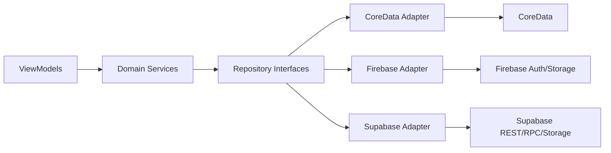

# Data Layer Transition v1 (CoreData/Firebase -> Supabase)

## 1. 목적
DogArea 앱의 데이터 계층을 단계적으로 Supabase 중심으로 전환한다.
문서 우선 원칙에 따라, 구현 이슈는 본 문서의 계약을 그대로 따른다.

연결 이슈:
- 문서: #38
- 구현: #23, #30, #31

## 2. 현재 문제
- ViewModel이 `CoreDataProtocol`에 직접 결합되어 도메인/저장소 분리가 약함.
- 사용자/반려견은 `UserDefaults + FirebaseStorage/Auth` 혼합 상태.
- 저장소 실패 시 재시도/보상 로직이 화면 단에 흩어져 있음.

## 3. 전환 원칙
1. 읽기 안정성 우선: 초기에는 기존 로컬 읽기 유지
2. 쓰기 일관성 강화: 신규 쓰기는 Supabase로 이중쓰기
3. 기능 플래그로 단계적 전환
4. 실패는 큐 기반 재시도, 사용자 행동은 블로킹 최소화

## 4. 목표 아키텍처


## 5. Repository 인터페이스 계약

## 5.1 WalkRepository
```swift
protocol WalkRepository {
    func fetchWalkSessions(ownerId: String, petId: UUID?) async throws -> [WalkSessionDTO]
    func fetchWalkPoints(sessionId: UUID) async throws -> [WalkPointDTO]
    func saveWalk(session: WalkSessionDTO, points: [WalkPointDTO]) async throws
    func deleteWalk(sessionId: UUID) async throws
}
```

## 5.2 PetRepository
```swift
protocol PetRepository {
    func fetchPets(ownerId: String) async throws -> [PetDTO]
    func upsertPet(_ pet: PetDTO) async throws
    func setSelectedPet(ownerId: String, petId: UUID) async throws
}
```

## 5.3 ProfileRepository
```swift
protocol ProfileRepository {
    func fetchProfile(ownerId: String) async throws -> ProfileDTO?
    func upsertProfile(_ profile: ProfileDTO) async throws
    func uploadProfileImage(ownerId: String, data: Data) async throws -> URL
}
```

## 6. DTO 표준
- `WalkSessionDTO`
  - `id`, `ownerUserId`, `petId`, `startedAt`, `endedAt`, `durationSec`, `areaM2`, `mapImageURL`, `sourceDevice`
- `WalkPointDTO`
  - `sessionId`, `seqNo`, `lat`, `lng`, `recordedAt`
- `PetDTO`
  - `id`, `ownerUserId`, `name`, `photoURL`, `caricatureURL`, `isActive`
- `ProfileDTO`
  - `id`, `displayName`, `profileImageURL`

## 7. 단계별 전환

### 단계 A (문서/인터페이스)
- 저장소 인터페이스 추가
- 기존 ViewModel은 adapter 주입 구조로 전환만 수행
- 동작은 기존과 동일

### 단계 B (이중쓰기)
- 읽기: CoreData/기존 로컬 우선
- 쓰기: CoreData 성공 후 Supabase enqueue
- Supabase 실패 시 `outbox` 큐에 저장 후 백그라운드 재전송

### 단계 C (읽기 전환)
- feature flag로 Supabase read 전환
- CoreData는 캐시/오프라인 보조로 축소

### 단계 D (Firebase 축소)
- Auth/Storage 중 대체 가능한 경로부터 Supabase로 대체
- Firebase 의존 제거 범위를 릴리스 단위로 분할

## 8. 실패/재시도 정책

| 유형 | 예시 | 사용자 노출 | 재시도 정책 | 비고 |
|---|---|---|---|---|
| 네트워크 일시 장애 | timeout, DNS | 토스트(저장 지연) | 지수 백오프 3회 | outbox 유지 |
| 서버 검증 오류 | 400/422 | 즉시 실패 메시지 | 재시도 안 함 | 입력 수정 필요 |
| 인증 만료 | 401 | 재로그인 유도 | 토큰 갱신 후 1회 | 세션 복구 |
| 충돌 | duplicate/409 | 자동 정합화 | upsert 전략 | idempotency key 사용 |

## 9. 동기화/보상 트랜잭션
- 로컬 저장 성공 + 원격 실패:
  - outbox에 작업 저장
  - 앱 foreground 진입/네트워크 복구 시 재시도
- 원격 성공 + 로컬 실패:
  - 로컬 캐시 복구 작업 생성
  - 다음 fetch에서 self-heal

## 10. Feature Flag 정의
- `ff_repo_layer_v1`
- `ff_dual_write_v1`
- `ff_supabase_read_v1`

기본값:
- `ff_repo_layer_v1 = on`
- `ff_dual_write_v1 = on`
- `ff_supabase_read_v1 = off`

## 11. 운영 체크리스트

### 구현 전
- [ ] Repository/DTO 네이밍 확정
- [ ] ViewModel 직접 CoreData 접근 지점 목록화

### 구현 중
- [ ] 신규 저장 동작에 idempotency key 적용
- [ ] outbox 실패 로그 수집
- [ ] 기존 기능 회귀(산책 저장/목록/상세) 통과

### 구현 후
- [ ] `ff_supabase_read_v1` 내부 사용자 ON
- [ ] 저장 성공률/재시도율 모니터링
- [ ] 문제 없으면 점진 확대

## 12. 테스트 시나리오
1. 산책 저장 정상 경로: 로컬+원격 동시 반영
2. 네트워크 오프라인 저장: outbox 적재 후 온라인 복구 반영
3. 인증 만료 중 저장: 재인증 후 재시도 성공
4. 중복 요청: idempotency로 1회 반영
5. 선택 반려견 변경 후 저장: petId 일관성 유지

## 13. 비범위
- 근처 사용자 익명 핫스팟 구현 상세(#45)
- 캐리커처 provider 라우터 상세(#44/#41)
- 다견 N:M 본 구현 상세(#27)

## 14. 마이그레이션 메모
- CoreData 모델 구조(`PolygonEntity`, `LocationEntity`)는 임시 캐시 용도로 유지
- Supabase canonical source 전환 후 CoreData write 경로 축소
- Firebase Storage 경로는 Supabase Storage 경로로 점진 대체
