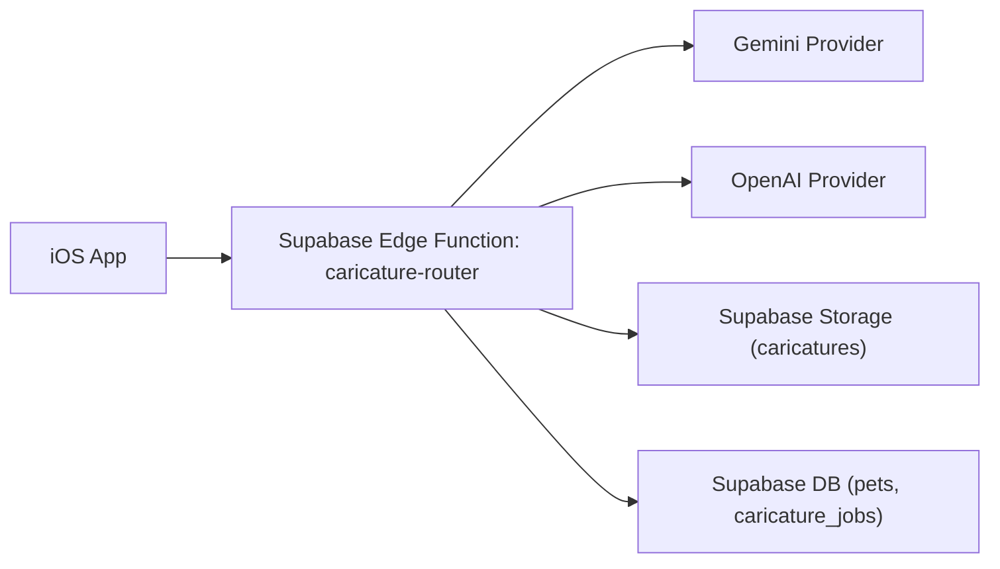

# Image Provider Router v1 (OpenAI/Gemini)

## 1. 목적
이미지 생성(강아지 캐리커처) 공급자 추상화를 서버 프록시 기준으로 고정한다.
앱은 단일 API 계약만 사용하고, 실제 모델 선택/폴백은 서버 라우터가 담당한다.

연결 이슈:
- 문서: #41
- 구현: #24, #44

## 2. 범위
- Provider Router API 계약(Request/Response/Error)
- 공급자 우선순위/폴백/재시도 정책
- 비용/품질 모니터링 지표
- 앱 표시 UX 및 재시도 UX
- 장애 대응 런북

## 3. 아키텍처


원칙:
- 앱에 공급자 API 키 직접 보관 금지
- Edge Function 시크릿으로만 공급자 키 관리
- 라우팅/폴백/재시도는 서버에서 결정

## 4. API 계약 (Edge Function)
엔드포인트:
- `POST /functions/v1/caricature`

인증:
- `Authorization: Bearer <supabase_access_token>` 필수

요청 바디:
```json
{
  "petId": "uuid",
  "sourceImagePath": "<user-id>/<pet-id>/petProfile.jpg",
  "style": "cute_cartoon",
  "providerHint": "auto",
  "requestId": "uuid"
}
```

요청 필드 규칙:
- `petId` 필수
- `sourceImagePath` 필수
- `style` 선택: `cute_cartoon`, `line_illustration`, `watercolor` (기본 `cute_cartoon`)
- `providerHint` 선택: `auto`, `gemini`, `openai` (기본 `auto`)
- `requestId` 권장(멱등성)

성공 응답:
```json
{
  "jobId": "uuid",
  "petId": "uuid",
  "status": "ready",
  "provider": "gemini",
  "fallbackUsed": false,
  "caricaturePath": "<user-id>/<pet-id>/<job-id>.png",
  "caricatureUrl": "https://...",
  "latencyMs": 14320
}
```

진행중 응답(비동기 큐 모델 확장 대비):
```json
{
  "jobId": "uuid",
  "petId": "uuid",
  "status": "processing"
}
```

오류 응답 공통 포맷:
```json
{
  "errorCode": "UPSTREAM_TIMEOUT",
  "message": "gemini timeout",
  "provider": "gemini",
  "requestId": "uuid"
}
```

오류 코드:
- `UNAUTHORIZED`
- `INVALID_REQUEST`
- `SOURCE_IMAGE_NOT_FOUND`
- `UPSTREAM_TIMEOUT`
- `UPSTREAM_REJECTED`
- `ALL_PROVIDERS_FAILED`
- `STORAGE_UPLOAD_FAILED`
- `DB_UPDATE_FAILED`

## 5. 라우팅/폴백/재시도

기본 정책:
- 1순위: Gemini
- 2순위: OpenAI

시간 제한:
- provider 호출 timeout: 25초

재시도:
- provider별 최대 2회
- backoff: 1s -> 2s

폴백 트리거:
- timeout, 5xx, 네트워크 오류, 컨텐츠 정책 거절(재시도 불가 유형 제외)

종료 조건:
- 첫 성공 즉시 종료
- 모두 실패 시 `failed` 반환 + `caricature_jobs` 실패 기록

## 6. 데이터 반영 계약

### 6.1 `caricature_jobs`
- 생성 시: `queued`
- provider 호출 시작: `processing`
- 성공: `ready`
- 최종 실패: `failed`

필드:
- `id`, `user_id`, `pet_id`, `style`, `provider_chain`, `status`, `error_message`, `retry_count`, `created_at`, `updated_at`

### 6.2 `pets`
성공 시 업데이트:
- `caricature_url`
- `caricature_status = ready`
- `caricature_provider`
- `caricature_style`

실패 시 업데이트:
- `caricature_status = failed`

### 6.3 Storage
- 버킷: `caricatures`
- 경로: `caricatures/{user_id}/{pet_id}/{job_id}.png`

## 7. 앱 UX 계약

### 7.1 프로필 생성 흐름
1. 원본 사진 업로드 완료 후 가입 플로우 즉시 완료
2. 캐리커처는 비동기 실행
3. 상태 표시:
- `queued/processing`: "캐릭터 생성 중"
- `ready`: 자동 이미지 교체 + 완료 토스트
- `failed`: 원본 유지 + "다시 만들기" 버튼

### 7.2 Provider 표시
- 설정/디버그 영역에서 마지막 성공 provider 표시
- 사용자 노출 텍스트는 단순화: `AI 생성 완료`

### 7.3 재시도 UX
- 실패 카드에 `다시 만들기`
- 동일 `style` 재시도 가능
- style 변경 후 재시도 가능

## 8. 모니터링 지표
필수 지표:
- `caricature.success_rate`
- `caricature.failure_rate`
- `caricature.latency.p50/p95`
- `caricature.fallback_rate`
- `caricature.provider_share` (gemini/openai)
- `caricature.retry.avg_count`
- `caricature.cost.estimate` (provider 단가 기준)

알람 기준(초기):
- 성공률 < 90% (15분)
- p95 지연 > 30s (15분)
- fallback_rate > 40% (30분)

## 9. 장애 대응 런북

### 9.1 증상: Gemini 연속 timeout
조치:
1. 라우터 우선순위를 OpenAI 우선으로 임시 전환
2. timeout 값을 25s -> 18s로 임시 축소
3. 장애 공지(내부) 및 원복 계획 기록

### 9.2 증상: OpenAI 실패 증가
조치:
1. OpenAI provider 일시 차단
2. Gemini 단일 운영
3. 실패 요청은 `failed`로 마킹 후 재시도 버튼 유지

### 9.3 증상: Storage 업로드 실패
조치:
1. DB 업데이트 중단(불완전 URL 방지)
2. `STORAGE_UPLOAD_FAILED` 반환
3. 재처리 잡 큐에 적재

### 9.4 증상: DB 업데이트 실패
조치:
1. 업로드 파일은 유지
2. 잡 상태 `failed` + error_message 기록
3. 관리자 재처리 스크립트 실행

## 10. 보안 규칙
- 앱에는 anon key만 배포
- `OPENAI_API_KEY`, `GEMINI_API_KEY`, `SUPABASE_SERVICE_ROLE_KEY`는 Edge Function 시크릿 전용
- 로그에 원본 이미지/base64 본문 저장 금지
- requestId/userId/petId 중심으로 추적

## 11. 검증 체크리스트
- [ ] providerHint=auto에서 Gemini 우선 호출 확인
- [ ] Gemini 실패 시 OpenAI 폴백 확인
- [ ] timeout/retry 정책대로 동작 확인
- [ ] 성공 시 pets 상태/URL 업데이트 확인
- [ ] 실패 시 원본 이미지 유지 + 재시도 버튼 노출 확인
- [ ] 지표 수집 및 알람 규칙 동작 확인

## 12. 비범위
- 완전한 모델 품질 벤치마크 자동화
- 사용자별 과금/쿼터 화면
- 멀티 리전 라우팅
