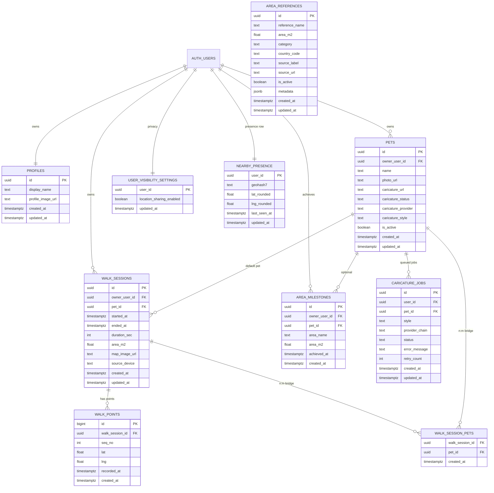

# Supabase Schema v1 Spec (DogArea)

## 1. 목적
이 문서는 DogArea의 Supabase 데이터 모델을 v1 기준으로 확정하기 위한 단일 명세서다.
문서 우선 원칙에 따라, 앱/워치/API 구현은 본 명세를 기준으로 진행한다.

우선순위 고정:
1. Supabase 스키마 확정/마이그레이션
2. 앱 데이터 레이어 전환
3. 다견가정 기능 반영
4. 명소 넓이 데이터 확장
5. 이미지 생성 공급자 추상화

## 2. 범위
- 사용자/다견/산책/좌표/명소비교 구조
- 캐리커처 비동기 파이프라인용 데이터 구조
- 근처 사용자 익명 핫스팟용 데이터 구조
- RLS 정책 원칙
- Storage 경로 규칙
- 마이그레이션/롤백 절차

## 3. 도메인 ERD

## 4. 테이블 계약 (v1)

### 4.1 핵심 산책
- `walk_sessions`
  - 1차 릴리스: 산책 1건 = 기본 반려견 1마리(`pet_id`)
  - 2차 확장: `walk_session_pets`로 N:M 반려견 연결
- `walk_points`
  - 산책 좌표 원장
  - `unique(walk_session_id, seq_no)` 보장

### 4.2 반려견/프로필
- `profiles`: 사용자 프로필
- `pets`: 반려견 기본 정보 + 캐리커처 상태
  - `caricature_status` 허용값: `queued`, `processing`, `ready`, `failed`

### 4.3 비교군
- `area_references`: 지자체/명소 넓이 비교 데이터
- `area_milestones`: 사용자(또는 반려견) 달성 이력

### 4.4 캐리커처 비동기
- `caricature_jobs`
  - 상태 전이: `queued -> processing -> ready|failed`
  - `provider_chain` 예시: `gemini>openai`
  - `retry_count` 기본 0, 최대 2

### 4.5 근처 사용자 익명 핫스팟
- `user_visibility_settings`
  - `location_sharing_enabled` 기본 `false`
- `nearby_presence`
  - 사용자 1행 upsert 패턴
  - TTL 10분 기준으로 집계 시 제외

## 5. RLS 정책 원칙
- 사용자 데이터는 `auth.uid()` 소유 범위로만 접근
- `area_references`는 읽기 공개(`anon`, `authenticated`)
- 쓰기 권한은 앱 사용자에 최소 권한만 허용
- Service Role은 Edge Function 백엔드 전용

정책 매트릭스:
- `profiles/pets/walk_sessions/walk_points/area_milestones/walk_session_pets`
  - `select/insert/update/delete`: 소유자만
- `area_references`
  - `select`: 전체 공개
  - `insert/update/delete`: `service_role`
- `caricature_jobs`
  - `select`: 소유자
  - `insert/update`: Edge Function(service role) + 안전 조건
- `user_visibility_settings`
  - 소유자만 읽기/수정
- `nearby_presence`
  - 소유자 upsert
  - 익명 조회는 RPC/View 통해 집계 결과만 반환

## 6. Storage 규칙
버킷:
- `profiles`
- `caricatures`
- `walk-maps`

경로 규칙:
- `profiles/{user_id}/userProfile.jpg`
- `profiles/{user_id}/{pet_id}/petProfile.jpg`
- `caricatures/{user_id}/{pet_id}/{job_id}.png`
- `walk-maps/{user_id}/{walk_session_id}.jpg`

보안 규칙:
- 앱에는 `SUPABASE_URL`, `SUPABASE_ANON_KEY`만 배포
- `SUPABASE_SERVICE_ROLE_KEY`는 Edge Function 시크릿으로만 사용

## 7. 마이그레이션 순서
1. 확장/기본 함수 생성(`set_updated_at`)
2. 핵심 테이블 생성(`profiles`, `pets`, `walk_sessions`, `walk_points`, `area_milestones`, `walk_session_pets`)
3. 비교군 테이블 생성(`area_references`) 및 seed
4. 캐리커처/근처 기능 테이블 생성(`caricature_jobs`, `user_visibility_settings`, `nearby_presence`)
5. 인덱스 생성
6. RLS enable + 정책 적용
7. Storage bucket/policy 적용
8. 검증 쿼리 실행

## 8. 운영 체크리스트

### 8.1 적용 전
- [ ] `supabaseConfig.xcconfig`에 URL/anon/project_ref만 사용 중인지 확인
- [ ] 서비스 키가 앱 코드/Info.plist/xcconfig에 없는지 점검
- [ ] 마이그레이션 dry-run 수행

### 8.2 적용 중
- [ ] `supabase db push --linked --dry-run` 성공
- [ ] `supabase db push --linked` 성공
- [ ] `supabase migration list --linked` 반영 확인

### 8.3 적용 후
- [ ] 핵심 테이블 존재 확인
- [ ] RLS 정책 존재/활성 확인
- [ ] Storage 버킷/경로 권한 확인
- [ ] 샘플 사용자로 read/write smoke test

## 9. 롤백 기준
- 원칙: destructive rollback 금지
- 장애 발생 시:
  1. 신규 write 차단(플래그)
  2. 문제 정책만 selective revert
  3. 백업 스냅샷 기반 복구
- 데이터 삭제가 필요한 롤백은 운영 승인 후 진행

## 10. 구현 연결 이슈
- 스키마/운영 고도화: #22
- CoreData -> Supabase 이중쓰기/백필: #23
- 다견 1차 UX: #26
- 다중 반려견 N:M 2차: #27
