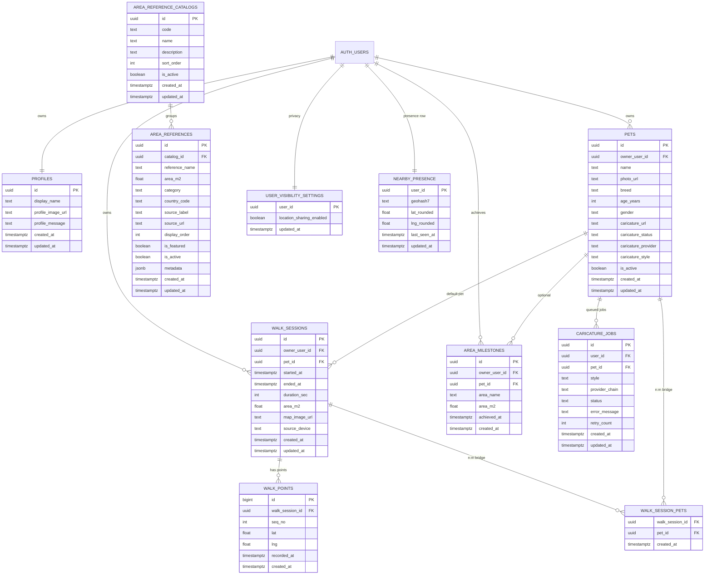

# Supabase Schema v1 Spec (DogArea)

## 1. 목적
이 문서는 DogArea의 Supabase 데이터 모델을 v1 기준으로 확정하기 위한 단일 명세서다.
문서 우선 원칙에 따라, 앱/워치/API 구현은 본 명세를 기준으로 진행한다.

우선순위 고정:
1. Supabase 스키마 확정/마이그레이션
2. 앱 데이터 레이어 전환
3. 다견가정 기능 반영
4. 명소 넓이 데이터 확장
5. 이미지 생성 공급자 추상화

## 2. 범위
- 사용자/다견/산책/좌표/명소비교 구조
- 캐리커처 비동기 파이프라인용 데이터 구조
- 근처 사용자 익명 핫스팟용 데이터 구조
- 시즌 안티 농사 점수 규칙용 데이터 구조
- 체감 날씨 피드백 KPI 뷰
- 날씨 치환/스트릭 보호 서버 엔진 구조
- 라이벌 공정 리그 매칭 구조
- RLS 정책 원칙
- Storage 경로 규칙
- 마이그레이션/롤백 절차

## 3. 도메인 ERD

## 4. 테이블 계약 (v1)

### 4.1 핵심 산책
- `walk_sessions`
  - 1차 릴리스: 산책 1건 = 기본 반려견 1마리(`pet_id`)
  - 2차 확장: `walk_session_pets`로 N:M 반려견 연결
- `walk_points`
  - 산책 좌표 원장
  - `unique(walk_session_id, seq_no)` 보장

### 4.2 반려견/프로필
- `profiles`: 사용자 프로필
- `pets`: 반려견 기본 정보 + 캐리커처 상태
  - 확장 필드: `profile_message`, `breed`, `age_years`, `gender`
  - `age_years` 허용값: `0..30` (nullable)
  - `gender` 허용값: `unknown`, `male`, `female`
  - `caricature_status` 허용값: `queued`, `processing`, `ready`, `failed`

### 4.3 비교군
- `area_reference_catalogs`: 비교군 카탈로그(큐레이션/정렬/활성 관리)
- `area_references`: 지자체/명소 넓이 비교 데이터
  - `catalog_id` 기반 그룹화
  - `display_order`, `is_featured` 기반 홈/상세 노출 순서 제어
- `area_milestones`: 사용자(또는 반려견) 달성 이력

### 4.4 캐리커처 비동기
- `caricature_jobs`
  - 상태 전이: `queued -> processing -> ready|failed`
  - `provider_chain` 예시: `gemini>openai`
  - `retry_count` 기본 0, 최대 2

### 4.5 근처 사용자 익명 핫스팟
- `user_visibility_settings`
  - `location_sharing_enabled` 기본 `false`
- `nearby_presence`
  - 사용자 1행 upsert 패턴
  - TTL 10분 기준으로 집계 시 제외

### 4.6 시즌 안티 농사 점수
- `season_scoring_policies`
  - 동일 타일 반복 억제/신규 경로 보너스/차단 임계값을 서버 파라미터로 관리
- `season_tile_score_events`
  - 포인트 단위 점수 원장(`base_score`, `novelty_bonus`, `suppression_reason`)
- `season_score_audit_logs`
  - 반복 파밍 의심/차단 판정 근거 로그
- `season_catchup_buff_policies`
  - 복귀 버프 정책(비활동 임계/지급기간/보정률/주간한도/시즌종료 차단구간)
- `season_catchup_buff_grants`
  - 복귀 버프 지급/차단 상태(`status`, `blocked_reason`, `abuse_flag`) 기록
- `rpc_score_walk_session_anti_farming`
  - 세션 점수 계산 결과 + UX 설명(`explain.ui_reason`) 반환
  - 복귀 버프 점수/상태(`catchup_bonus`, `catchup_buff_active`, `explain.catchup_buff`) 동시 반환

### 4.7 체감 날씨 피드백 KPI
- `view_weather_feedback_kpis_7d`
  - `weather_feedback_submitted/rate_limited/weather_risk_reevaluated` 기반 일자별 지표 집계
  - `changed_ratio`, `rate_limited_ratio`로 오탐/정탐/남용 상태 관측

### 4.8 날씨 치환/스트릭 보호 엔진
- `weather_replacement_runtime_policies`
  - 일일 치환 한도(`daily_replacement_limit`) + 주간 Shield 한도(`weekly_shield_limit`) 정책
- `weather_replacement_mappings`
  - 위험 단계(`caution|bad|severe`)별 대체 퀘스트 매핑
- `weather_replacement_histories`
  - 치환 이력/사유/원퀘스트/대체퀘스트/보호 적용 여부 원장
- `weather_shield_ledgers`
  - 주차 단위 Shield 소진 원장
- `rpc_apply_weather_replacement`
  - 일일 최대 1회 치환 + 주간 1회 Shield 정책 확정
- `view_weather_replacement_audit_14d`
  - 14일 치환/Shield 집계 관측

### 4.9 라이벌 공정 리그 매칭
- `rival_league_policies`
  - 14일 활동량/주간 반영/표본 fallback 임계값을 서버 파라미터로 관리
- `rival_league_assignments`
  - 사용자 최신 스냅샷 리그(`league`)와 fallback 적용 결과(`effective_league`)
- `rival_league_history`
  - 승격/강등/병합 변경 이력
- `rpc_refresh_rival_leagues`
  - 주간 리그 재산정 및 히스토리 기록
- `rpc_get_my_rival_league`
  - 앱 조회용 본인 리그/안내 메시지 반환
- `view_rival_league_distribution_current`
  - 최신 리그 분포/표본 상태 모니터링

### 4.10 주간 시즌 정책 고정(Stage 1)
- 정책 문서: `docs/season-weekly-policy-stage1-v1.md`
- v1 고정값:
  - 신규 타일 점령 `+5`
  - 동일 타일 유지 방문(일 1회) `+1`
  - 48시간 유예 후 하루 `-2` 감쇠(하한 0)
  - 동점 정렬: `active_tile_count -> new_tile_capture_count -> last_contribution_at -> user_id`
  - 티어 컷: `Bronze 80 / Silver 180 / Gold 320 / Platinum 520`
- 서버 파라미터 연결:
  - 점수/억제 정책: `season_scoring_policies`
  - 복귀/보정 정책: `season_catchup_buff_policies`
  - Stage2 구현 시 `season_runs`, `season_user_scores`, `season_rewards`로 정산 스냅샷/보상 영속화 확장

### 4.11 시즌 집계/정산 파이프라인(Stage 2)
- 파이프라인 문서: `docs/season-stage2-pipeline-v1.md`
- 신규 테이블:
  - `season_runs`: 시즌 기간/정책/정산 상태(`active|settling|settled`)
  - `tile_events`: 타일 점수 일 단위 원장 + 멱등키(`season_id+owner_user_id+tile_id+event_day`)
  - `season_tile_scores`: 타일별 원점수/감쇠/유효점수
  - `season_user_scores`: 사용자별 리더보드 집계(랭크/티어)
  - `season_rewards`: 시즌 종료 보상 발급 이력(멱등 발급)
- 신규 RPC:
  - `rpc_ingest_season_tile_events(target_walk_session_id, now_ts)`
  - `rpc_apply_season_daily_decay(target_season_id, now_ts)` (`service_role`)
  - `rpc_finalize_season(target_season_id, now_ts)` (`service_role`)
  - `rpc_get_season_leaderboard(target_season_id, top_n)`
- 운영 관측:
  - `view_season_batch_status_14d`

## 5. RLS 정책 원칙
- 사용자 데이터는 `auth.uid()` 소유 범위로만 접근
- `area_references`는 읽기 공개(`anon`, `authenticated`)
- 쓰기 권한은 앱 사용자에 최소 권한만 허용
- Service Role은 Edge Function 백엔드 전용

정책 매트릭스:
- `profiles/pets/walk_sessions/walk_points/area_milestones/walk_session_pets`
  - `select/insert/update/delete`: 소유자만
- `area_references`
  - `select`: 전체 공개
  - `insert/update/delete`: `service_role`
- `area_reference_catalogs`
  - `select`: 전체 공개(활성 카탈로그)
  - `insert/update/delete`: `service_role`
- `caricature_jobs`
  - `select`: 소유자
  - `insert/update`: Edge Function(service role) + 안전 조건
- `user_visibility_settings`
  - 소유자만 읽기/수정
- `nearby_presence`
  - 소유자 upsert
  - 익명 조회는 RPC/View 통해 집계 결과만 반환
- `season_scoring_policies`
  - `select`: 공개(읽기)
- `season_tile_score_events`, `season_score_audit_logs`, `season_catchup_buff_grants`
  - `select`: 소유자
  - write: 서비스 경로(RPC/service role)
- `season_catchup_buff_policies`
  - `select`: 공개(읽기)
- `season_runs`
  - `select`: 공개(시즌 상태 조회)
- `tile_events`, `season_tile_scores`, `season_user_scores`, `season_rewards`
  - `select`: 소유자
  - write: 서비스 경로(RPC/service role)
- `view_weather_feedback_kpis_7d`
  - `select`: 공개(운영 관측용)
- `weather_replacement_runtime_policies`, `weather_replacement_mappings`
  - `select`: 공개(정책/매핑 조회)
- `weather_replacement_histories`, `weather_shield_ledgers`
  - `select`: 소유자
  - write: 서비스 경로(RPC/service role)
- `view_weather_replacement_audit_14d`
  - `select`: 공개(운영 관측용)
- `rival_league_policies`
  - `select`: 공개(정책 조회)
- `rival_league_assignments`, `rival_league_history`
  - `select`: 소유자
  - write: 서비스 경로(RPC/service role)
- `view_rival_league_distribution_current`
  - `select`: 공개(운영 관측용)

## 6. Storage 규칙
버킷:
- `profiles`
- `caricatures`
- `walk-maps`

경로 규칙:
- `profiles/{user_id}/userProfile.jpg`
- `profiles/{user_id}/{pet_id}/petProfile.jpg`
- `caricatures/{user_id}/{pet_id}/{job_id}.png`
- `walk-maps/{user_id}/{walk_session_id}.jpg`

보안 규칙:
- 앱에는 `SUPABASE_URL`, `SUPABASE_ANON_KEY`만 배포
- `SUPABASE_SERVICE_ROLE_KEY`는 Edge Function 시크릿으로만 사용

## 7. 마이그레이션 순서
1. 확장/기본 함수 생성(`set_updated_at`)
2. 핵심 테이블 생성(`profiles`, `pets`, `walk_sessions`, `walk_points`, `area_milestones`, `walk_session_pets`)
3. 비교군 테이블 생성(`area_reference_catalogs`, `area_references`) 및 seed
4. 캐리커처/근처 기능 테이블 생성(`caricature_jobs`, `user_visibility_settings`, `nearby_presence`)
5. 시즌 점수/복귀 버프 테이블 및 RPC 생성(`season_*`)
6. 인덱스 생성
7. RLS enable + 정책 적용
8. Storage bucket/policy 적용
9. 검증 쿼리 실행

## 8. 운영 체크리스트

### 8.1 적용 전
- [ ] `supabaseConfig.xcconfig`에 URL/anon/project_ref만 사용 중인지 확인
- [ ] 서비스 키가 앱 코드/Info.plist/xcconfig에 없는지 점검
- [ ] 마이그레이션 dry-run 수행

### 8.2 적용 중
- [ ] `supabase db push --linked --dry-run` 성공
- [ ] `supabase db push --linked` 성공
- [ ] `supabase migration list --linked` 반영 확인

### 8.3 적용 후
- [ ] 핵심 테이블 존재 확인
- [ ] RLS 정책 존재/활성 확인
- [ ] Storage 버킷/경로 권한 확인
- [ ] 샘플 사용자로 read/write smoke test

## 9. 롤백 기준
- 원칙: destructive rollback 금지
- 장애 발생 시:
  1. 신규 write 차단(플래그)
  2. 문제 정책만 selective revert
  3. 백업 스냅샷 기반 복구
- 데이터 삭제가 필요한 롤백은 운영 승인 후 진행

## 10. 구현 연결 이슈
- 스키마/운영 고도화: #22
- CoreData -> Supabase 이중쓰기/백필: #23
- 다견 1차 UX: #26
- 다중 반려견 N:M 2차: #27

운영 실행 문서:
- `docs/supabase-migration.md`
